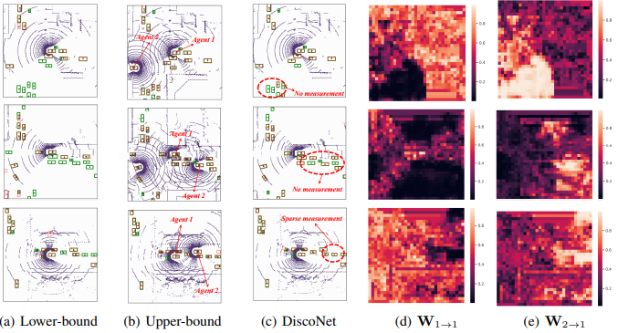
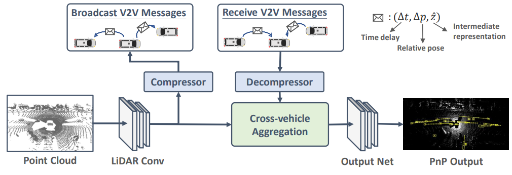

# Models

For the following tutorial, suppose that we are using `Config` and `criterion` as follows:  

```python
from coperception.models.det import *
from coperception.utils.CoDetModule import FaFModule
from coperception.configs import Config
from coperception.utils.loss import SoftmaxFocalClassificationLoss, WeightedSmoothL1LocalizationLoss
import torch.optim as optim

import numpy as np
import torch

batch_size = 4
num_agent = 6
width = 256
height = 256
num_channels = 13
collaboration_layer = 3
learning_rate = 0.001

# randomly generated data
data = {'bev_seq': torch.rand(num_agent * batch_size, 1, width, height, num_channels),
        'labels': torch.rand(num_agent * batch_size, width, height, num_agent, 2),
        'reg_targets': torch.rand(num_agent * batch_size, width, height, num_agent, 1, num_agent),
        'anchors': torch.rand(num_agent * batch_size, width, height, num_agent, num_agent),
        'reg_loss_mask': torch.from_numpy(np.random.choice(a=[False, True], size=(num_agent * batch_size, width, height, num_agent, 1))),
        'vis_maps': np.random.rand(num_agent * batch_size, 0),
        'target_agent_ids': np.random.choice(a=[i for i in range(num_agent)], size=(batch_size, num_agent)),
        'num_agent': np.random.choice(a=[i for i in range(num_agent)], size=(batch_size, num_agent)),
        'trans_matrices': np.random.choice(a=[i for i in range(num_agent)], size=(batch_size, num_agent, num_agent, batch_size, batch_size)),}

config = Config('train', binary=True, only_det=True)
criterion = {'cls': SoftmaxFocalClassificationLoss(), 'loc': WeightedSmoothL1LocalizationLoss()}
```
<br> 

## FaFNet
::: coperception.models.det.FaFNet.FaFNet
    selection:
      members: none


### Detection
**train**
```python
model = FaFNet(
        config, 
        layer=collaboration_layer, 
        kd_flag=False, 
        num_agent=num_agent
)

config.flag = 'lowerbound' # [lowerbound / upperbound]
optimizer = optim.Adam(model.parameters(), lr=learning_rate)
faf_module = FaFModule(
        model=model,
        teacher=None,
        config=config, 
        optimizer=optimizer,
        criterion=criterion, 
        kd_flag=False
)

loss, cls_loss, loc_loss = faf_module.step(data, batch_size, num_agent=num_agent)
```
**test**


<br> 

## DiscoNet

::: coperception.models.det.DiscoNet.DiscoNet
    selection:
      members: none




**Usage (detection)**

For DiscoNet, we need a pre-trained model as the teacher net in the knowledge distillation process.  
In the DiscoNet paper above, we used `FaFNet` as the teacher net.  
Before training DiscoNet, we need to train `FaFNet` and save its weights.  
In the following example code, we load the weights to `TeacherNet` and use it as the teacher model to train `DiscoNet`.  
`TeacherNet` has the same architecture as `FaFNet`. You can checkout its implementation here:  
::: coperception.models.det.TeacherNet.TeacherNet
    selection:
      members: none

<br/>
Example code to train `DiscoNet`:  
```python
teacher = TeacherNet(config)  # Teacher model for DiscoNet

checkpoint_teacher = torch.load('/path/to/faf_net/checkpoint/file.pth')
teacher.load_state_dict(checkpoint_teacher['model_state_dict'])
teacher.eval() # Put in evaluation mode. TeacherNet is already trained.

model = DiscoNet(
        config, 
        layer=collaboration_layer, 
        kd_flag=True, 
        num_agent=num_agent
)

config.flag = 'disco'
optimizer = optim.Adam(model.parameters(), lr=learning_rate)

faf_module = FaFModule(
        model=model,
        teacher=teacher,
        config=config, 
        optimizer=optimizer,
        criterion=criterion, 
        kd_flag=True
)

loss, cls_loss, loc_loss = faf_module.step(data, batch_size, num_agent=num_agent)
```

<br>
## V2VNet
::: coperception.models.det.V2VNet.V2VNet
    selection:
      members: none



**Usage (detection)**
```python
model = V2VNet(
        config, 
        gnn_iter_times=3, 
        layer=collaboration_layer, 
        layer_channel=256, 
        num_agent=num_agent
)

config.flag = 'v2v'
optimizer = optim.Adam(model.parameters(), lr=learning_rate)

faf_module = FaFModule(
        model=model,
        teacher=None,
        config=config, 
        optimizer=optimizer,
        criterion=criterion, 
        kd_flag=False
)

loss, cls_loss, loc_loss = faf_module.step(data, batch_size, num_agent=num_agent)
```

<br>

## When2com
::: coperception.models.det.When2com.When2com
    selection:
      members: none


**Usage (detection, using warp)**
``` python
model = When2com(
        config, 
        layer=collaboration_layer,
        warp_flag=True,
        num_agent=num_agent
)

config.flag = 'when2com_warp'
optimizer = optim.Adam(model.parameters(), lr=learning_rate)

faf_module = FaFModule(
        model=model,
        teacher=None,
        config=config, 
        optimizer=optimizer,
        criterion=criterion, 
        kd_flag=False
)

loss, cls_loss, loc_loss = faf_module.step(data, batch_size, num_agent=num_agent)
```

**Usage (detection, not  using warp)**
```python
model = When2com(
        config, 
        layer=collaboration_layer,
        warp_flag=False,
        num_agent=num_agent
)

config.flag = 'when2com'
optimizer = optim.Adam(model.parameters(), lr=learning_rate)

faf_module = FaFModule(
        model=model,
        teacher=None,
        config=config, 
        optimizer=optimizer,
        criterion=criterion, 
        kd_flag=False
)

loss, cls_loss, loc_loss = faf_module.step(data, batch_size, num_agent=num_agent)
```